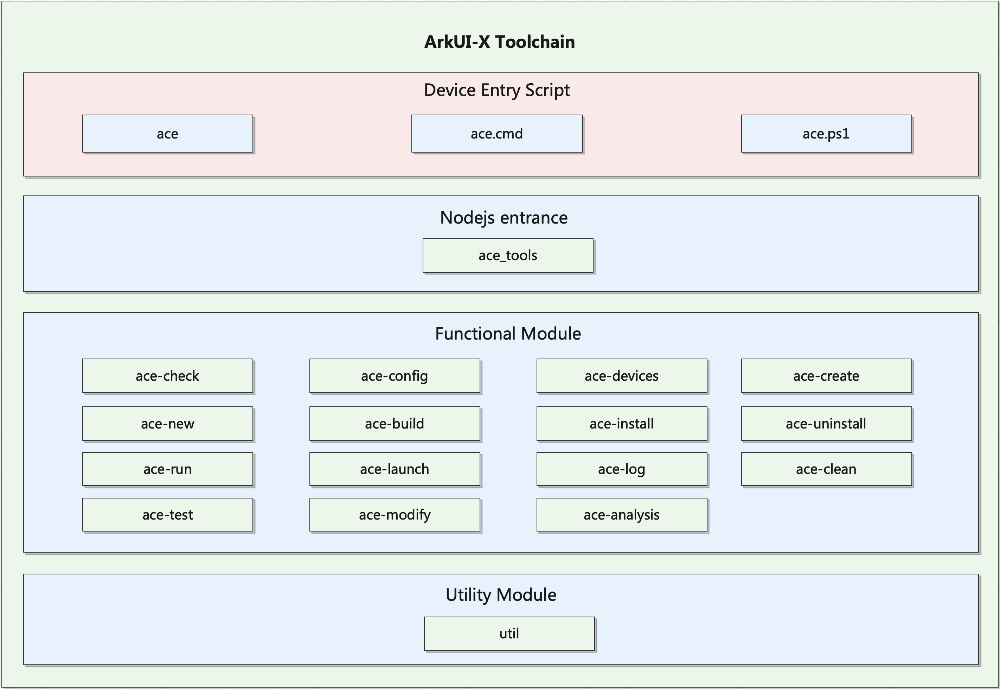

# ACE Tools

## Introduction
ACE Tools is a command line (CLI) tool that allows ArkUI-X project developers to build applications on the OpenHarmony, Android, and iOS platforms. Its functions include development environment check, project creation, building and packaging, and installation and debugging.

For details about setting up an environment for using ACE Tools，see [ACE Tools Quick Guide](https://gitee.com/arkui-x/docs/blob/master/zh-cn/application-dev/quick-start/start-with-ace-tools.md).

ACE stands for Ability Cross-platform Environment. It is a cross-platform programming framework dedicated to OpenHarmony.

**Figure 1** Structure of ACE Tools



The script file used as the tool entry varies depending on the platform. Use the appropriate script file to launch the tool. Then, run **ace_tools.js** through Node.js, and use the commander module of npm to parse the commands and execute the exported methods of each sub-module.

## Directory Structure
For details about the source code structure of the ArkUI-X project, see [ArkUI-X Project Structure](https://gitee.com/arkui-x/docs/blob/master/en/framework-dev/quick-start/project-structure-guide.md). The code of the ACE Tools is available at **//developtools/ace_tools**. The directory structure is as follows:

```
/developtools/ace_tools/cli
├── src                         # Source code
│   ├── ace-build               # Build code
│   ├── ace-check               # Development environment checking
│   ├── ace-clean               # Build result clearing
│   ├── ace-config              # ACE toolchain configuration
│   ├── ace-create              # Project and application templates
│   ├── ace-devices             # Query of all connected ACE devices
│   ├── ace-install             # ArkUI-X application installation
│   ├── ace-launch              # ArkUI-X application launch
│   ├── ace-log                 #  ArkUI-X application run log
│   ├── ace-run                 # ArkUI-X application build and run
|   ├── ace-test                # ArkUI-X application build and excute test case like unitTest or uiTest
│   ├── ace-uninstall           # ArkUI-X application uninstall
│   ├── bin                     # Device entry scripts
│   └── util                    # Utilities
└── templates                   # Templates
    ├── andriod                 # Android project templates
    ├── ets_fa                  # ArkTS-based declarative development paradigm templates
    ├── ios                     # iOS project templates
    ├── js_fa                   # JS-compatible web-like development paradigm templates
    └── ohos_fa                 # OpenHarmony project templates
```

## How to Use

### ace config

Adds ACE Tools-specific configuration, including the OpenHarmony SDK directory, Android SDK directory, Node.js directory, and build output directory.

Syntax:

```shell
ace config [options] <path>
```

| Parameter         | Description               |
| ------------- | ------------------- |
| --openharmony-sdk | OpenHarmony SDK directory.|
| --android-sdk | Android SDK directory.   |
| --nodejs-dir  | Node.js directory.       |
| --build-dir   | Build output directory.    |
| --deveco-studio-path | DevEco Studio installation directory (optional).|
| --android-studio-path | Android Studio installation directory (optional).|
| --java-sdk | JDK directory.|

### ace check

Checks the ArkUI-X application development environment.

The following table lists the check items.

| Item        | Description                        | Windows | Linux | Mac  |
| ---------------- | ---------------------------- | ------- | ----- | ---- |
| Node.js           | Node.js directory.                 | Yes     | Yes   | Yes  |
| OpenHarmony SDK  | OpenHarmony SDK directory.         | Yes     | Yes   | Yes  |
| Android SDK      | Android SDK directory.             | Yes     | Yes   | Yes  |
| DevEco Studio    | DevEco Studio installation directory.       | Yes     | No   | Yes  |
| Android Studio   | Android Studio installation directory.      | Yes     | Yes   | Yes  |
| Connected device        | All currently connected devices.          | Yes     | Yes   | Yes  |
| Xcode            | Xcode version.           | No     | No   | Yes  |
| libimobiledevice | libimobiledevice version.| No     | No   | Yes  |
| ios-deploy       | ios-deploy version.      | No     | No   | Yes  |

Syntax:

```shell
ace check
```

No parameters need to be specified.

Reference command output:

```shell
ohos@user ~ % ace check
[√] OpenHarmony toolchains - develop for OpenHarmony devices
  • SDK at /Users/ohos/Desktop/sdk
  • Node.js Runtime Environment at /usr/local/bin/node
  • Java SDK at /Library/Java/JavaVirtualMachines/jdk-18.0.2.1.jdk/Contents/Home
[√] Android toolchains - develop for Android devices
  • SDK at /Users/ohos/Library/Android/sdk
[√] DevEco Studio
  • DevEco Studio at /Applications/deveco-studio.app
[!] Android Studio
  ! Android Studio is not installed, you can install in https://developer.android.google.cn/studio 
[√] iOS toolchains - develop for iOS devices
  • Xcode 13.3Build version 13E113
  • idevicesyslog 1.3.0
  • 1.11.4
Tools info :[×] hdc is not installed [√] adb installed [√] ios-deploy installed
[√] Connected device (1 available)
  • iOS Devices	[....] Found 00008020-001C0D92146A002E (N841AP, iPhone XR, iphoneos, arm64e, 15.0, 19A346) a.k.a. 'iPhone Xr 15.0' connected through USB.

  √ Ace-check found no issues.
```

### ace devices

Lists all connected devices. On Windows and Linux, you can query the currently connected Android and OpenHarmony devices. 

On Mac, you can query the currently connected Android, OpenHarmony, and iOS devices.


Syntax:

```shell
ace devices
```

No parameters need to be specified.

Reference command output:

```shell
ohos@user ~ % ace devices
Tools info :[×] hdc is not installed [√] adb installed [√] ios-deploy installed
[√] Connected device (1 available)
  • iOS Devices	[....] Found 00008020-001C0D92146A002E (N841AP, iPhone XR, iphoneos, arm64e, 15.0, 19A346) a.k.a. 'iPhone Xr 15.0' connected through USB.
```

### ace create project

Creates an ArkUI-X project.

If the project already exists, a prompt is displayed, asking you whether to delete the project.

When creating a project, you need to specify the project name and package name in sequence. If you do not enter the package name, it will be defaulted to **com.example.***project name*.


Syntax:

```shell
ace create project
```

Prompt asking whether to delete the existing project:

```shell
The project already exists. Do you want to delete the directory (Y / N):
```

Prompt indicating that the existing project is deleted successfully:

```shell
Delete directory successfully, creating new project...:
```

Prompt indicating a failure to delete the existing project:

```shell
Failed to create project, project directory already exists!
```

Prompt for entering the project name:

```shell
Please input project name:
```

Prompt for entering the package name:

```shell
Please input package name: com.example.${projectName}:
```

Prompt for entering the project version:

```shell
Please enter the ACE version (1: ArkTS-based declarative development paradigm, 2: JS-compatible web-like development paradigm):
```

Prompt indicating that the project is created successfully:

```shell
Project created. Target directory: ${projectName}
```

### ace create module

Creates an ArkUI-X application module.


You need to run the command in the **source** directory of the newly created ArkUI-X project. Then, enter the module name at the following prompt:

```shell
Please input module name:
```

If the module name already exists, the system displays the message **${module name} already exists**. Change the module name, and press **Enter**. The ArkUI-X application module is successfully created.

### ace build

Builds an ArkUI-X application installation package.

Syntax:

```shell
ace build [options] [fileType]
```

You can build HAP and APK packages on Windows and Linux, and build HAP, APK, and App packages on Mac.

**Note:** On DevEco Studio, open the project to build and enable automatic signing as follows: Go to **File** > **Project Structure** > **Project** > **Signing Configs**, and select **Automatically generate signature**. Then, run the **ace build** command to build the signed HAP installation package. On Mac, use Xcode to open the corresponding iOS project, enable automatic signing on the **Singing** tab on the **Build settings** page, and run the build command.

- options

| Option               | Description                                      |
| --------------------- | ------------------------------------------ |
| --target [moduleName] | Specifies the name of the target module.                  |
| -r --release          | Sets the type of the application to **release**. The default type is **debug**.|
| --nosign              | Builds an unsigned application (for App package only).         |
| -h --help             | Displays the help information.                            |

- fileType

| Parameter| Description                                                  |
| ---- | ------------------------------------------------------ |
| hap  | HAP package of the OpenHarmony application. If **fileType** is not specified, the value is defaulted to **hap**.|
| apk  | APK package of the Android application.                                 |
| app  | App package of the iOS application.                                  |

Reference command output:

```shell
HAP file built successfully..
File path: /Users/ohos/WorkSpace/demo/ohos/entry/build/default/outputs/default
```

### ace install

Installs an ArkUI-X application on a connected device.


Syntax:

```shell
ace install [options] [fileType]
```

You can install HAP and APK packages on Windows and Linux, and install HAP, APK, and App packages on Mac.

- options

| Option             | Description              |
| ------------------- | ------------------ |
| -d [deviceId]       | Specifies the ID of the device for installing the application.|
| --device [deviceId] | Specifies the ID of the device for installing the application.|

- fileType

| Parameter| Description                                                  |
| ---- | ------------------------------------------------------ |
| hap  | HAP package of the OpenHarmony application. If **fileType** is not specified, the value is defaulted to **hap**.|
| apk  | APK package of the Android application.                                 |
| app  | App package of the iOS application.                                  |

Command output:

```shell
ohos@user % ace install app
Install APP successfully.
```

### ace uninstall

Uninstalls an ArkUI-X application on a connected device.

Syntax:

```shell
ace uninstall [options] [fileType]
```

- options

| Option               | Description                  |
| --------------------- | ---------------------- |
| -d [deviceId]         | Specifies the ID of the device running the application to uninstall.|
| --device [deviceId]   | Specifies the ID of the device running the application to uninstall.|
| --bundle [bundleName] | Bundle name of the application to uninstall.  |

- fileType

| Parameter| Description                                                  |
| ---- | ------------------------------------------------------ |
| hap  | HAP package of the OpenHarmony application. If **fileType** is not specified, the value is defaulted to **hap**.|
| apk  | APK package of the Android application.                                 |
| app  | App package of the iOS application.                                  |

Command output:

```shell
ohos@user % ace uninstall --bundle com.example.${projectName} app
Uninstall APP successfully.
```

### ace log

Displays the logs of an ArkUI-X application in scrolling mode.

By default, only logs related to processes of the ArkUI-X application are generated.

Syntax:

```shell
ace log [options] [fileType]
```

- options

| Option             | Description                  |
| ------------------- | ---------------------- |
| -d [deviceId]       | Specifies the ID of the device running the ArkUI-X application.|
| --device [deviceId] | Specifies the ID of the device running the ArkUI-X application.|

- fileType

| Parameter| Description                                               |
| ---- | --------------------------------------------------- |
| hap  | HAP package of the OpenHarmony application. If **fileType** is not specified, the value is defaulted to **hap**.|
| apk  | APK package of the Android application.                                 |
| app  | App package of the iOS application.                                  |

### ace run

Runs an ArkUI-X application.

This command checks whether the target device is connected, determines the device type, and then performs operations such as building, installing, and starting an ArkUI-X application, and generating application process logs.

On Windows and Linux, you can build, install, and run HAP and APK packages. On Mac, you can build, install, and run HAP, APK, and App packages.

Syntax:

```shell
ace run [options] [fileType]
```

- options

| Option             | Description                  |
| ------------------- | ---------------------- |
| -d [deviceId]       | Specifies the ID of the device on which the ArkUI-X application is run.|
| --device [deviceId] | Specifies the ID of the device on which the ArkUI-X application is run.|

- fileType

| Parameter| Description                                                        |
| ---- | ------------------------------------------------------------ |
| hap  | HAP package of the OpenHarmony application. If **fileType** is not specified, the value is defaulted to **hap**.|
| apk  | APK package of the Android application.                                 |
| app  | App package of the iOS application.                                  |


### ace test

ArkUI-X application build and excute test case like unitTest or uiTest.

This command checks whether the target device is connected, determines the device type, and then performs operations such as building, installing, and excute an ArkUI-X  test case, and output test reports.

On Windows and Linux, you can build, install, and test APK packages. On Mac, you can build, install, and test APK, and App packages.

Syntax:

```shell
ace run [options] [fileType]
```

- options

| Option             | Description                  |
| ------------------- | ---------------------- |
| -d [deviceId]       | Specifies the ID of the device on which the ArkUI-X application is run.|
| --device [deviceId] | Specifies the ID of the device on which the ArkUI-X application is run.|
| --b [testBundleName] | Specifies the Test BundleName on which the ArkUI-X application excute.|
| --m [testModuleName] | Specifies the Test ModuleName on which the ArkUI-X application excute. |
| --unittest [testRunner] | Specifies the Test testRunner on which the ArkUI-X application excute. |
| --timeout [timeout] | Specifies the timeout on which the ArkUI-X application excute. |
| --skipInstall | Skip install only if app/apk has been installed.（Still rely on the app/apk package, If 'path' is specified, use the app/apk package specified by 'path'. Otherwise, use the app/apk package in default path）|
| --path [path] | Specifies the path of package to install and test directly. |

- fileType

| Parameter| Description                                                        |
| ---- | ------------------------------------------------------------ |
| apk  | APK package of the Android application.                                 |
| app  | App package of the iOS application.    

### ace clean

Clears the build results of an ArkUI-X application.

Syntax:

```shell
ace clean
```

Command output:

```shell
Project cleaned up.
```

### ace help

Obtains the CLI help for an ArkUI-X application.

Syntax:

```shell
ace help <subcommand>
```

| Option   | Description                                                        |
| --------- | ------------------------------------------------------------ |
| devices   | Lists all connected devices.                                        |
| check     | Checks the ArkUI-X application development environment.                                    |
| config    | Adds ACE Tools-specific configuration, including the OpenHarmony SDK directory, Android SDK directory, Node.js directory, and build output directory.|
| create    | Creates an ArkUI-X application or module.                    |
| build     | Builds an ArkUI-X application installation package.                                      |
| install   | Installs an ArkUI-X application on a connected device.                            |
| uninstall | Uninstalls an ArkUI-X application on a connected device.                                  |
| launch    | Launches an ArkUI-X application on a connected device.                                    |
| log       | Displays the logs of an ArkUI-X application in scrolling mode.                        |
| run       | Runs an ArkUI-X application.                                          |
| clean     | Clears the build results of an ArkUI-X application.                                    |
| help      | Obtains the CLI help for an ArkUI-X application.                                  |

The prompt is as follows:

```shell
ohos@user % ace help
Usage: ace <command> [options]

Options:
  -V, --version                   output the version number
  -d, --device <device>           input device id to specify the device to do something
  -h, --help                      display help for command

Commands:
  create [subcommand]             create ace project/module/component
  check                           check sdk environment
  devices                         list the connected devices.
  config [options]                
          --openharmony-sdk [OpenHarmony SDK]
          --android-sdk   [Android SDK]
          --deveco-studio-path [DevEco Studio Path]
          --android-studio-path [Android Studio Path]
          --build-dir     [Build Dir]
          --nodejs-dir    [Nodejs Dir]
          --java-sdk      [Java SDK]
  build [options] [fileType]      build hap/apk/app of moduleName
  install [options] [fileType]    install hap/apk/app on device
  uninstall [options] [fileType]  uninstall hap/apk/app on device
  run [options] [fileType]        run hap/apk on device
  launch [options] [fileType]     launch hap/apk on device
  log [fileType]                  show debug log
  clean                           clean project
    test [options] [fileType]       test apk/app on device
        --b                   [Test BundleName]
        --m                   [Test ModuleName]
        --unittest            [TestRunner]
        --timeout             [Test timeout]
  help [command]                  display help for command
```
