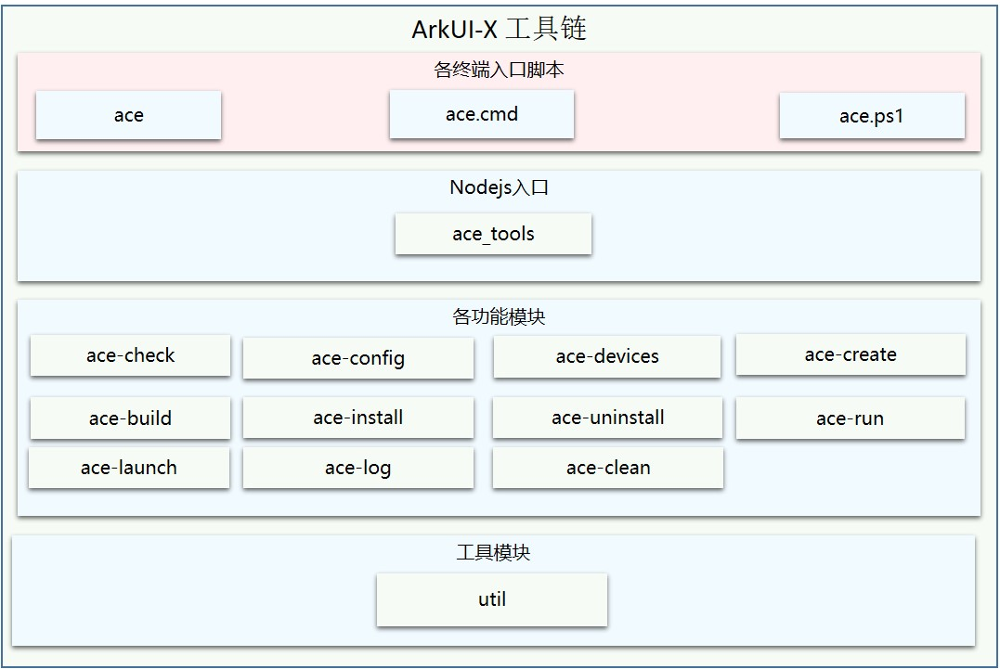

# 快速指南

## 简介

ArkUI-X Command Line Tools，是一套为跨平台应用开发者提供的命令行工具，用于构建OHOS、Android和iOS平台的应用程序， 其功能包括开发环境检查，新建项目，编译打包，安装调试等。

图1 ArkUI-X Command Line Tools模块结构



命令行各平台使用不同脚本文件做为入口，再通过nodejs执行到ace_tools.js文件，使用npm模块commander解析命令行执行各子模块导出的方法。

## 目录介绍

ArkUI开发框架的源代码结构参见 [代码工程结构及构建说明](https://gitee.com/arkui-crossplatform/doc/blob/master/application-dev/quick-start/project-structure-guide.md) , ACE工具链的代码在/developtools/ace_tools/cli 下，目录结构如下图所示：

```
/developtools/ace_tools/cli
├── src                         # 命令相关
│   ├── ace-build               # 构建跨平台应用安装包
│   ├── ace-check               # 查验跨平台应用开发环境
│   ├── ace-clean               # 清理跨平台应用编译结果
│   ├── ace-config              # 设置ace工具链相关配置
│   ├── ace-create              # 创建跨平台应用工程及应用模块
│   ├── ace-devices             # 查询当前所有连接的设备
│   ├── ace-install             # 将跨平台应用安装到连接的设备上
│   ├── ace-launch              # 在设备上运行ArkUI跨平台应用
│   ├── ace-log                 # 展示正在运行的跨平台应用的 log
│   ├── ace-run                 # 编译并在设备上运行ArkUI跨平台应用
│   ├── ace-uninstall           # 将跨平台应用从连接的设备上卸载
│   ├── bin                     # 各终端入口脚本
│   └── util                    # 工具模块
└── templates                   # 模板相关
    ├── andriod                 # andriod工程模板
    ├── ets_fa                  # ets工程模板
    ├── ios                     # ios工程模板
    ├── js_fa                   # js工程模板
    └── ohos_fa                 # openharmony工程模板
```

## 使用说明

### 环境安装

在使用命令行工具创建工程之前，请先检查本地开发环境：

1. NodeJS

   命令行运行 `node -v` 查看本地nodejs版本。如不存在，请自行下载安装新的稳定版本：[NodeJS下载地址](https://nodejs.org/en/download/)。建议下载14.19.1以上版本。

2. Java

   命令行运行 `java -version` 查看本地Java版本。如不存在，请自行下载安装新的稳定版本，同时配置相关环境变量：[JDK下载地址](https://repo.huaweicloud.com/openjdk/)。建议下载JDK11.0.2以上版本。

3. OpenHarmony SDK

   编译 hap 需要OpenHarmony SDK 支持，具体参考[DevEco Studio及SDK Manager下载地址](https://developer.harmonyos.com/cn/develop/deveco-studio)。

   

   **SDK推荐环境变量配置：**

   [Linux]

   ```shell
   // 配置环境变量
   export OpenHarmony_HOME=/home/usrername/path-to-ohsdk
   export PATH=${OpenHarmony_HOME}/toolchains/versioncode:${PATH}
   ```

   [Mac]

   ```shell
   // 配置环境变量
   export OpenHarmony_HOME=/Users/usrername/path-to-ohsdk
   export PATH=$OpenHarmony_HOME/toolchains/versioncode:$PATH
   ```

   [Windows]

   ```shell
   // 配置环境变量
   set OpenHarmony_HOME=/Users/usrername/path-to-ohsdk
   set PATH=%PATH%;%OpenHarmony_HOME%/toolchains/versioncode
   ```

4. Android SDK

   编译 apk 需要，Android SDK 支持通过安装Android Studio获得，具体参考[Android Studio及SDK Manager下载地址](https://developer.android.com/studio)。

   

   **SDK推荐环境变量配置：**

   [Linux]

   ```shell
   // 配置环境变量
   export ANDROID_HOME=/home/usrername/path-to-android-sdk
   export PATH=${ANDROID_HOME}/tools:${ANDROID_HOME}/tools/bin:${ANDROID_HOME}/build-tools/28.0.3:${ANDROID_HOME}/platform-tools:${PATH}
   ```

   [Mac]

   ```shell
   // 配置环境变量
   export ANDROID_HOME=/Users/usrername/path-to-android-sdk
   export PATH=$ANDROID_HOME/tools:$ANDROID_HOME/tools/bin:$ANDROID_HOME/build-tools/28.0.3:$ANDROID_HOME/platform-tools:$PATH
   ```

   [Windows]

   ```shell
   // 配置环境变量
   set ANDROID_HOME=/home/usrername/path-to-android-sdk
   set PATH=%PATH%;%ANDROID_HOME%/tools;%ANDROID_HOME%/tools/bin;%ANDROID_HOME%/build-tools/28.0.3;%ANDROID_HOME%/platform-tools
   ```

5. Mac依赖

   5.1 Xcode和Command Line Tools for Xcode应用可前往苹果商店下载安装。

   Command Line Tools也可使用命令方式安装:

   ```shell
   xcode-select --install
   ```

   5.2 libimobiledevice

   ```shell
   brew install libimobiledevice
   ```

   详细信息参照：[libimobiledevice安装](https://libimobiledevice.org)

   5.3 ios-deploy

   ```shell
   brew install ios-deploy
   ```

   详细信息参照：[ios-deploy 安装](https://github.com/ios-control/ios-deploy)

### 依赖安装

修改npm源：

​	前往用户目录下在.npmrc文件中添加如下内容：

```shell
@ohos:registry=https://repo.harmonyos.com/npm/
registry=https://repo.huaweicloud.com/repository/npm/
```

可以在工具链cli目录执行安装命令，安装cli依赖包。

```shell
cd ace_tools/cli
npm install . -g
```

*注：如遇到全局安装失败，可先执行npm install，再执行npm install . -g*

### 创建应用

#### 1. 检查开发环境

   ```shell
   ace check
   ```

执行 `ace check` 命令可以检查上述的本地开发环境。对于必选项，需要检查通过，否则无法继续接下来的操作。

*注：开发环境检查主要针对SDK和IDE的默认安装和下载路径；如果通过SDK Manager下载SDK，会检查默认环境变量：ANDROID_HOME和OpenHarmony_HOME是否配置。*

#### 2. 检查设备连接

   ```shell
   ace devices
   ```

获得当前连接的设备devices 及 deviceID。后续命令的参数需要加 deviceID，可随时执行查看。

*注：该命令已经集成在 ` ace check` 中，可跳过。*

#### 3. 开发环境路径配置

   ```shell
   ace config
   ```

如果开发者没有按照IDE和SDK默认路径进行安装和下载，可通过此命令进行自定义路径配置。

#### 4. 创建project

   以创建一个 ‘demo’  项目为例：

   ```shell
   ace create project
   ? Please enter the project name: demo
   ? Please enter the packages (com.example.demo):com.example.demo
   ? Please enter the ACE version (1: 声明式范式, 2: 类Web范式): 1
   ```

执行 `ace create project` 命令（project 可省略），接着输入项目名 demo ，包名直接回车默认即可。输入“1”代表创建ArkUI声明式范式应用项目。

一个名为 ‘demo’ 的项目就创建成功了。

项目关键结构如下：

```shell
demo/
├── android		//用于编译跨平台应用Android工程
│   ├── app
│   │   ├── libs
│   │   └── src
│   │       ├── androidTest
│   │       ├── main
│   │       │   ├── AndroidManifest.xml
│   │       │   ├── assets	//用于存放跨平台应用编译生成的资源文件
│   │       │   ├── java
│   │       │   │   └── com
│   │       │   │       └── example
│   │       │   │           └── demo
│   │       │   │               ├── MainActivity.java	//继承自ArkUI提供的AceActivity基类
│   │       │   │               └── MyApplication.java	//继承自ArkUI提供的AceApplication基类
│   │       │   └── res
│   │       └── test
│   └── settings.gradle
├── ios		//用于编译跨平台应用ios工程
│   ├── etsapp
│   │   ├── AppDelegate.h
│   │   ├── AppDelegate.mm	//实例化AceViewController，并加载ArkUI页面
│   │   ├── Info.plist
│   │   └── main.m
│   ├── etsapp.xcodeproj
│   ├── frameworks
│   └── js
│   └── res
├── ohos	//用于编译跨平台应用ohos工程
│   ├── build-profile.json5
│   ├── entry
│   │   └── src
│   │       └── main
│   │           ├── config.json
│   │           └── resources
└── source	//用于编写跨平台应用源码
    └── entry
        └── src
            ├── main
            │   ├── ets
            │   │   └── MainAbility
            │   │       ├── app.ets
            │   │       ├── manifest.json	//工程配置信息
            │   │       └── pages
            │   │           └── index
            │   │               └── index.ets
            │   └── resources
            └── ohosTest

```

### 编写代码

在上述工程创建完成后，开发者可在项目中的source目录下进行代码开发。

### 项目编译

开始对 'demo' 项目进行编译。编译分为hap 、apk和app：

   ```shell
cd demo
   ```

1. 编译hap，默认编译所有Module

   ```shell
   ace build hap
   ```

   每个Module生成一个hap应用文件，默认路径为 demo/ohos/entry/build/default/outputs/default/。

2. 编译hap，只编译指定的Module

   ```shell
   ace build hap --target moduleName
   ace build hap --target "moduleName1 moduleName2 ..."
   ```

   最终各module会在对应目录下生成一个hap应用文件。默认路径为 demo/ohos/moduleName/build/default/outputs/default/。

   *注：当前版本指定Module编译时，需要先完成entry模块编译，多个Module可分别加在 --target 参数后，使用引号包括目标Module名并使用空格分开。*

3. 编译apk，默认编译Module为app的模块

   ```shell
   ace build apk
   ```

   最终会生成一个apk应用文件，默认路径为：demo/android/app/build/outputs/apk/debug/。

4. 编译apk，编译指定的Module

   ```shell
   ace build apk --target moduleName
   ```

   最终会生成一个apk应用文件。默认路径为：demo/android/app/build/outputs/apk/debug/。

5. 编译app，默认编译Module为app的模块

   ```shell
   ace build app
   ```
   
   最终生成一个app应用文件，默认路径为：demo/ios/build/outputs/app/
   
6. 编译app，编译指定的Module

   ```shell
   ace build app --target moduleName
   ```

   最终会生成一个app应用文件。默认路径为：demo/ios/build/outputs/app/

### 应用安装和卸载

开始对编译出的应用包进行安装，先进入到demo工程目录下

   ```shell
cd demo
   ```

1. 安装hap应用安装包

   ```shell
   ace install hap
   ```

2. 安装hap应用到指定的设备上

   ```shell
   ace install hap -d deviceId
   ```

3. 安装apk应用安装包

   ```shell
   ace install apk
   ```

4. 安装apk应用安装包到指定的设备上

   ```shell
   ace install apk -d deviceId
   ```

5. 安装app应用安装包

   ```shell
   ace install app
   ```

6. 安装app应用安装包到指定的设备上

   ```shell
   ace install app -d deviceId
   ```

7. 卸载hap应用安装包

   ```shell
   ace uninstall hap --bundle bundleName
   ```

8. 卸载指定设备上的hap应用安装包

   ```shell
   ace uninstall hap --bundle bundleName -d deviceId
   ```

9. 卸载apk应用安装包

   ```shell
   ace uninstall apk --bundle bundleName
   ```

10. 卸载指定设备上的apk应用安装包

    ```shell
    ace uninstall apk --bundle bundleName -d deviceId
    ```

11. 卸载app应用安装包

    ```shell
    ace uninstall app --bundle bundleName
    ```

12. 卸载指定设备上的app应用安装包

    ```shell
    ace uninstall app --bundle bundleName -d deviceId
    ```

###  运行应用

1. 运行hap应用

   ```shell
   ace run hap
   ```

2. 在指定的设备上运行hap应用

   ```shell
   ace run hap -d deviceId
   ```

3. 运行apk应用

   ```shell
   ace run apk
   ```

4. 在指定的设备上运行apk应用

   ```shell
   ace run apk -d deviceId
   ```

5. 运行app应用

   ```shell
   ace run app
   ```

6. 在指定的设备上运行app应用

   ```shell
   ace run app -d deviceId
   ```

### 清理编译结果

清除所有编译结果(hap、apk、app)

  ```shell
ace clean
  ```

### 输出日志文件

滚动输出正在运行的应用日志信息

1. 输出hap应用日志

  ```shell
ace log hap
  ```

2. 输出指定的设备上运行hap应用日志

  ```shell
ace log hap -d deviceId
  ```

3. 输出apk应用日志

  ```shell
ace log apk
  ```

4. 输出指定的设备上运行apk应用日志

  ```shell
ace log apk -d deviceId
  ```

5. 输出app应用日志

  ```shell
ace log app
  ```

6. 输出指定的设备上运行app应用日志

  ```shell
ace log app -d deviceId
  ```

### 帮助工具

展示可以支持的命令信息

  ```shell
ace help
  ```

支持单个指令支持查询

```shell
ace build --help
```

## 相关概念

ACE：元能力跨平台运行环境 (Ability Cross-platform Environment)。
