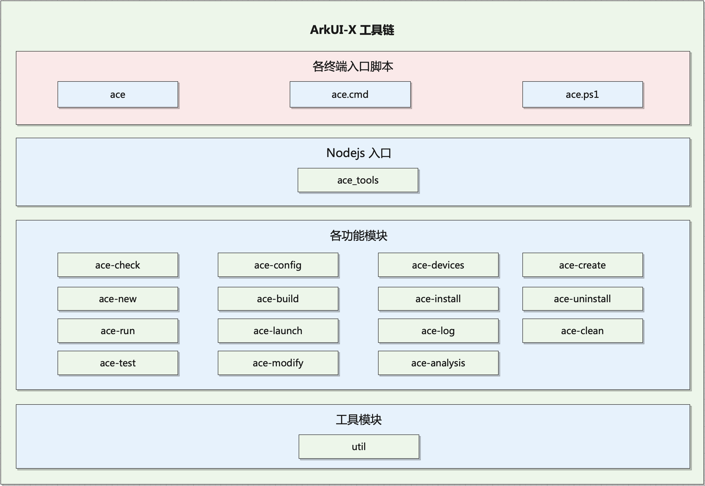

# ACE Tools

## 简介
ACE Tools是一套为ArkUI-X项目跨平台应用开发者提供的命令行工具，支持在Windows/Ubuntu/macOS平台运行，用于构建OpenHarmony/HarmonyOS、Android和iOS平台的应用程序，其功能包括开发环境检查，新建项目，编译打包，安装调试等。

如需搭建安装ACE Tools的运行环境请参考：[ACE Tools快速指南](https://gitee.com/arkui-x2/docs/blob/master/zh-cn/application-dev/quick-start/start-with-ace-tools.md)。

**注释：** ACE - ArkUI跨平台运行环境 (ArkUI Cross-platform Environment)。

图1 ACE Tools命令行工具模块结构



命令行各平台使用不同脚本文件做为入口，再通过Node.js执行到ace_tools.js文件，使用npm模块commander解析命令行执行各子模块导出的方法。

## 目录结构
ArkUI-X项目的源代码结构参见 [代码工程结构及构建说明](https://gitee.com/arkui-x/docs/blob/master/zh-cn/framework-dev/quick-start/project-structure-guide.md) , ACE Tools工具链的代码在//developtools/ace_tools下，目录结构如下图所示：

```
/developtools/ace_tools
├── lib/src/cli                 # 命令相关
│   ├── ace-build               # 构建跨平台应用安装包
│   ├── ace-check               # 查验跨平台应用开发环境
│   ├── ace-clean               # 清理跨平台应用编译结果
│   ├── ace-config              # 设置ACE工具链相关配置
│   ├── ace-create              # 创建跨平台应用工程及应用模块
│   ├── ace-devices             # 查询当前所有连接的设备
│   ├── ace-help                # 帮助命令
│   ├── ace-install             # 将跨平台应用安装到连接的设备上
│   ├── ace-launch              # 在设备上运行ArkUI跨平台应用
│   ├── ace-log                 # 展示正在运行的跨平台应用的日志
│   ├── ace-run                 # 编译并在设备上运行ArkUI跨平台应用
|   ├── ace-test                # 执行跨平台应用包单元测试
│   ├── ace-uninstall           # 将跨平台应用从连接的设备上卸载
│   └── util                    # 工具模块
├── lib
│   └── ace_tools.js            # 入口脚本
└── templates                   # 模板相关
    ├── android                 # Android工程模板
    ├── cpp                     # Native C++配置模板
    ├── cpp_ets_stage           # Stage Native C++开发模板
    ├── ets_stage               # Stage开发模板
    ├── framework               # framework工程模板
    ├── ios                     # iOS工程模板
    └── ohos_stage              # ohos Stage工程模板

```

## 使用方法

### ace config

设置ACE工具链相关配置，包括OpenHarmony SDK路径，HarmonyOS SDK路径、ArkUI-X SDK路径、Android SDK路径、Node.js路径、编译输出路径等。 

语法：

```shell
ace config [arguments]
```
- arguments

| 参数    | 说明                |
| ------------- | ------------------- |
| --android-sdk | Android SDK路径。    |
| --android-studio-path | Android Studio安装路径（可选参数）。 |
| --arkui-x-sdk | ArkUI-X SDK路径。 |
| --build-dir   | 编译输出的路径。     |
| --deveco-studio-path | DevEco Studio安装路径（可选参数）。 |
| --harmonyos-sdk | HarmonyOS SDK路径。 |
| --java-sdk | JDK路径。 |
| --nodejs-dir  | Node.js 路径。        |
| --ohpm-dir  | Ohpm路径。 |
| --openharmony-sdk | OpenHarmony SDK路径。 |

### ace check

查验跨平台应用开发环境。

需要检查的项：

| 检查内容         | 说明                         | Windows | Linux | Mac  |
| ---------------- | ---------------------------- | ------- | ----- | ---- |
| adb | Android设备调试工具 | 是 | 是 | 是 |
| Android SDK      | Android SDK路径              | 是      | 是    | 是   |
| Android Studio   | Android Studio安装路径       | 是      | 是    | 是   |
| ArkUI-X SDK      | ArkUI-X SDK路径             | 是      | 是     | 是 |
| DevEco Studio    | DevEco Studio安装路径        | 是      | 否    | 是   |
| HarmonyOS hdc | HarmonyOS设备调试工具 | 是 | 是 | 是 |
| HarmonyOS SDK    | HarmonyOS SDK路径          | 是      | 是    | 是   |
| ios-deploy       | 当前ios-deploy的版本号       | 否      | 否    | 是   |
| libimobiledevice | 当前libimobiledevice的版本号 | 否      | 否    | 是   |
| Node.js           | Node.js 路径                  | 是      | 是    | 是   |
| Ohpm            | Ohpm路径                   | 是      | 是     | 是 |
| OpenHarmony hdc | OpenHarmony调试工具 | 是 | 是 | 是 |
| OpenHarmony SDK  | OpenHarmony SDK路径          | 是      | 是    | 是   |
| Xcode            | 当前Xcode的版本号            | 否      | 否    | 是   |
| 连接设备         | 当前连接的所有设备           | 是      | 是    | 是   |

语法：

```shell
ace check [arguments]
```

- arguments

| 参数      | 说明           |
| --------- | -------------- |
| -v --v    | 显示详细结果。 |
| -h --help | 显示帮助信息。 |

执行结果参考：

```shell
ohos@user ~ % ace check
Check summary (to see all details, run ace check -v)
[√] ArkUI-X (ArkUI-X SDK version 1.1.1.5)
[√] OpenHarmony toolchains - develop for OpenHarmony devices (OpenHarmony SDK version 4.0.9.6)
[√] HarmonyOS toolchains - develop for HarmonyOS devices (HarmonyOS SDK version 3.1.0)
[√] Android toolchains - develop for Android devices (Android SDK version 34.0.0)
[√] DevEco Studio (version 4.0.3)
[√] Android Studio (version 2022.3)
[√] Xcode - develop for iOS (Xcode 14.3.1)
Tools info :[√] OpenHarmony hdc installed
            [√] HarmonyOS hdc installed
            [√] adb installed
            [√] ios-deploy installed
[√] Connected device (1 available)
  •  iPhone 14 Pro Max (1058643C-A725-4E19-AA62-781588C94A7F) [iOS Simulator]

  √ ACE Tools found no issues.

ohos@user ~ % ace check -v
[√] ArkUI-X (ArkUI-X SDK version 1.1.1.5)
  • ArkUI-X SDK at /Users/ohos/Library/ArkUI-X/Sdk
  • Node.js (v18.17.1) Runtime Environment at /usr/local/n/versions/node/18.17.1/
  • libimobiledevice 1.3.0
  • ios-deploy 1.12.2
[√] OpenHarmony toolchains - develop for OpenHarmony devices (OpenHarmony SDK version 4.0.9.6)
  • OpenHarmony SDK at /Users/ohos/Library/OpenHarmony/Sdk
  • Ohpm at /Users/ohos/Library/Huawei/ohpm
  • Java SDK at /Applications/deveco-studio.app/Contents/jbr/Contents/Home
  • OpenJDK Runtime Environment JBR-17.0.6+10-829.5-jcef (build 17.0.6+10-b829.5)
[√] HarmonyOS toolchains - develop for HarmonyOS devices (HarmonyOS SDK version 3.1.0)
  • HarmonyOS SDK at /Users/ohos/Library/Huawei/Sdk
  • Ohpm at /Users/ohos/Library/Huawei/ohpm
  • Java SDK at /Applications/deveco-studio.app/Contents/jbr/Contents/Home
  • OpenJDK Runtime Environment JBR-17.0.6+10-829.5-jcef (build 17.0.6+10-b829.5)
[√] Android toolchains - develop for Android devices (Android SDK version 34.0.0)
  • Android SDK at /Users/ohos/Library/Android/sdk
  • Java SDK at /Applications/Android Studio.app/Contents/jbr/Contents/Home
  • OpenJDK Runtime Environment (build 17.0.6+0-17.0.6b829.9-10027231)
[√] DevEco Studio (version 4.0.3)
  • DevEco Studio at /Applications/deveco-studio.app
  • Java SDK at /Applications/deveco-studio.app/Contents/jbr/Contents/Home
  • OpenJDK Runtime Environment JBR-17.0.6+10-829.5-jcef (build 17.0.6+10-b829.5)
[√] Android Studio (version 2022.3)
  • Android Studio at /Applications/Android Studio.app
  • Java SDK at /Applications/Android Studio.app/Contents/jbr/Contents/Home
  • OpenJDK Runtime Environment (build 17.0.6+0-17.0.6b829.9-10027231)
[√] Xcode - develop for iOS (Xcode 14.3.1)
  • Xcode at /Applications/Xcode.app
  • Build version 14E300c
Tools info :[√] OpenHarmony hdc installed
            [√] HarmonyOS hdc installed
            [√] adb installed
            [√] ios-deploy installed
[√] Connected device (1 available)
  •  iPhone 14 Pro Max (1058643C-A725-4E19-AA62-781588C94A7F) [iOS Simulator]

  √ ACE Tools found no issues.

```

### ace devices

列出当前所有连接的设备，Windows平台上可以查询到当前连接的Android(包括Android Studio的模拟器)和OpenHarmony/HarmonyOS设备；Linux平台上可以查询到当前连接的Android设备；

Mac平台上可以查询到当前连接的Android(包括Android Studio的模拟器)，OpenHarmony/HarmonyOS，iOS设备和Mac自带的iOS模拟器(可通过命令行open -a Simulator启动，需要安装Xcode)。


语法：

```shell
ace devices [arguments]
```
- arguments

| 参数      | 说明           |
| --------- | -------------- |
| -h --help | 显示帮助信息。 |

执行结果参考：

```shell
ohos@user ~ % ace devices
Tools info :[√] OpenHarmony hdc installed
            [√] HarmonyOS hdc installed
            [√] adb installed
            [√] ios-deploy installed
[√] Connected device (2 available)
  •  sdk_gphone64_x86_64 (emulator-5554) [Android]
  •  iPhone 14 Pro Max (1058643C-A725-4E19-AA62-781588C94A7F) [iOS Simulator]
```

### ace create project

创建跨平台应用工程。

创建过程中，需要开发者依次填写工程名称和包名称，如果开发者不输入包名称，默认为com.example.工程名。


语法：

```shell
ace create <output directory>
```

- options

| 选项                | 说明                                       |
| --------------------- | ------------------------------------------ |
| -t  --template \<type\>  | 指定创建工程。                  |
| -h --help             | 显示帮助信息。                             |

- type

| type        | 说明                      |
| ----------- | ------------------------- |
| app         | 创建普通arkui-x应用工程。 |
| library     | 创建aar/framework工程。   |
| plugin_napi | 创建native工程。          |

在当前目录创建test工程：

```shell
ohos@user:~/cli-project$ ace create test
? Enter the project name(test):  # 输入工程名称，不输入默认为文件夹名称
? Enter the bundleName (com.example.test):  # 输入包名，不输入默认为com.example.工程名
? Enter the runtimeOS (1: OpenHarmony, 2: HarmonyOS): 1 # 输入RuntimeOS系统
? Please select the Complie SDk (1: 10, 2: 11): 2 # 输入编译SDK版本

Project created. Target directory:  /home/ohos/cli-project/test.

In order to run your app, type:

    $ cd test
    $ ace run

Your app code is in test/entry.
```


### ace new module

新建跨平台应用模块(Module)


需要在新建的跨平台应用工程的根目录下执行，提示输入module名称：

```shell
Enter the module name:
```

如果此module name已存在，会提示开发者${module name} already exists.，开发者修改名称后，回车确认，可以成功新建出跨平台应用模块(Module)。

### ace new ability

新建跨平台应用Ability


需要在新建的跨平台应用工程的根目录/具体module目录下执行，提示输入Ability名称：

```shell
Enter the ability name:
```

如果此ability name已存在，会提示开发者abilityName name already exists!.，开发者修改名称后，回车确认，可以成功新建出跨平台应用Ability。

### ace build

构建跨平台应用安装包。

语法：

```shell
ace build <subCommand> [arguments]
```

在Windows和Linux平台上可构建Hap和Apk，在Mac平台上可构建Hap、Apk和App。

注：在DevEco Studio中打开要编译的工程配置自动签名，单击File > Project Structure > Project > Signing Configs界面勾选“Automatically generate signature”，等待自动签名完成即可，再执行ace build即可构建出签名hap安装包；在Mac上编译App之前需要使用Xcode打开对应ios工程，在Build settings的Singing进行签名配置，再执行编译命令；在Linux上无法签名。

- subCommand

| 子命令 | 说明                                                   |
| ---- | ------------------------------------------------------ |
| aab | 构建Android App Bundle文件。 |
| aar  | 构建Android应用 aar 包。                                 |
| apk  | 构建Android应用 apk 包。                                |
| bundle | 构建ArkUI cross-platform资源目录。 |
| hap  | 构建OpenHarmony/HarmonyOS应用 hap 包。 |
| ios  | 构建iOS应用 app 包。                                 |
| ios-framework  | 构建iOS应用 framework 包。                                 |
| ios-xcframework  | 构建iOS应用 xcframework 包。                                 |

- arguments

| 参数                           | 子命令                                                       | 说明                                         |
| ------------------------------ | ------------------------------------------------------------ | -------------------------------------------- |
| --debug                        | aab、aar、apk、bundle、hap、ios、ios-framework、ios-xcframework | 构建应用程序的类型为debug。                  |
| -r --release                   | aab、aar、apk、bundle、hap、ios、ios-framework、ios-xcframework | 构建应用程序的类型为release(默认为release)。 |
| --profile                      | aab、aar、apk、bundle、hap、ios、ios-framework、ios-xcframework | 构建应用程序的类型为profile。                |
| --nosign                       | ios、ios-framework、ios-xcframework                          | 构建出未签名的应用程序。                     |
| --target [moduleName]          | hap                                                          | 指定目标模块名进行构建。                     |
| --target-platform \<platform\> | apk、aab、aar、bundle                                        | 编译apk的目标平台[arm, arm64, x86_64]        |
| -s --simulator                 | ios、ios-framework、ios-xcframework                          | 构建ios模拟器对应包。                        |
| -analyze                 	     | hap、apk、ios                          						| 通过rom size工具对打出的包进行包体积解析；[rom size工具使用方法](https://wenote.welink.huaweicloud.com/wapp/pages/view/share/s/3uzJqw1UB17K2cEiuz15v7Y53hPdAM2pnN7K2-Ox4N05QdMh)。             |
| -h --help                      | aab、aar、apk、bundle、hap、ios、ios-framework、ios-xcframework | 显示帮助信息。                               |

构建完成，提示包生成路径:

```shell
HAP file built successfully..
File path: /Users/ohos/WorkSpace/demo/ohos/entry/build/default/outputs/default
```

### ace install

将跨平台应用安装到连接的设备上。


语法：

```shell
ace install [arguments]
```

在Windows和Linux平台上可以安装Hap和Apk应用包，在Mac平台上可以安装Hap、Apk和App应用包。
命令会根据options提示开发者选择对应平台的设备，如果只有一个设备连接，会直接安装到该设备上。
注：编译Release版本的Apk需要签名才能安装，请通过Android Studio完成签名或者编译Debug版本Apk安装。

- arguments

| 参数 | 说明                                                         |
| ---- | ------------------------------------------------------------ |
| apk  | 安装Android应用 apk 包，可选。                                 |
| hap  | 安装OpenHarmony/HarmonyOS应用 hap 包，可选。                   |
| ios  | 安装iOS应用 app 包，可选。                                     |

| 参数           | 说明                     |
| --------------------- | ------------------------ |
| --target [moduleName] | 指定目标模块名进行安装。 |
| -d --device \<deviceId\> | 指定运行应用的设备Id。|
| -h --help             | 显示帮助信息。           |


安装完成：

```shell
ohos@user % ace install
[1]:  iPhone 14 Pro (67B40DC8-111C-4B30-9987-08E3BE30016A) [iOS Simulator]
[2]:  iPhone 14 Pro Max (1058643C-A725-4E19-AA62-781588C94A7F) [iOS Simulator]
? Please choose one (or "q" to quit): 2
iOS APP installed.
```

### ace uninstall

将跨平台应用从连接的设备上卸载。命令会根据options提示开发者选择对应平台的设备，如果只有一个设备连接，会直接卸载该设备上的应用。

语法：

```shell
ace uninstall [arguments]
```
- arguments

| 参数 | 说明                                                         |
| ---- | ---------------------------------------------------------------- |
| apk  | 卸载Android应用 apk 包，可选。                                     |
| hap  | 卸载OpenHarmony/HarmonyOS应用 hap 包，可选。                       |
| ios  | 卸载iOS应用 app 包，可选。                                         |

| 参数    | 说明                   |
| --------------------- | -------------------------------------- |
| --bundle \<bundleName\> | 指定卸载应用的包名，iOS需为实际签名。   |
| -d --device \<deviceId\> | 指定运行应用的设备Id。                |
| -h --help             | 显示帮助信息。                          |

卸载完成：

```shell
ohos@user % ace uninstall --bundle com.example.${projectName}
[1]:  iPhone 14 Pro (67B40DC8-111C-4B30-9987-08E3BE30016A) [iOS Simulator]
[2]:  iPhone 14 Pro Max (1058643C-A725-4E19-AA62-781588C94A7F) [iOS Simulator]
? Please choose one (or "q" to quit): 2
iOS APP uninstalled.
```

### ace launch

在设备上运行跨平台应用。命令会根据options提示开发者选择对应平台的设备，如果只有一个设备连接，会直接运行该设备上的应用。需要在设备上安装跨平台应用后才能运行。

语法：

```shell
ace launch [arguments]
```
- arguments

| 参数 | 说明                                                         |
| ---- | ---------------------------------------------------------------- |
| apk  | 运行Android应用 apk 包，可选。                                     |
| hap  | 运行OpenHarmony/HarmonyOS应用 hap 包，可选。                       |
| ios  | 运行iOS应用 app 包，可选。                                         |

| 参数          | 说明                   |
| --------------------- | ---------------------- |
| --target [moduleName] | 指定目标模块名进行运行。 |
| -d --device \<deviceId\> | 指定运行应用的设备Id。|
| -h --help             | 显示帮助信息。           |

运行完成：

```shell
ohos@user % ace launch
[1]:  iPhone 14 Pro (67B40DC8-111C-4B30-9987-08E3BE30016A) [iOS Simulator]
[2]:  iPhone 14 Pro Max (1058643C-A725-4E19-AA62-781588C94A7F) [iOS Simulator]
? Please choose one (or "q" to quit): 2
iOS APP launched.
```

### ace log

滚动展示正在运行的跨平台应用的日志。命令会根据options提示开发者选择对应平台的设备，如果只有一个设备连接，会直接展示该设备上的应用日志。

默认只输出跨平台应用进程相关日志。

语法：

```shell
ace log [arguments]
```
- arguments

| 参数 | 说明                                                         |
| ---- | ------------------------------------------------------------ |
| apk  | 查看Android应用日志，可选。                                        |
| hap  | 查看OpenHarmony/HarmonyOS应用日志，可选。                          |
| ios  | 查看iOS应用日志，可选。                                            |

| 参数            | 说明                   |
| ------------------- | ---------------------- |
| -d --device \<deviceId\> | 指定运行应用的设备Id。 |
| -h --help             | 显示帮助信息。            |


```
ohos@user % ace log
[1]:  iPhone 14 Pro (67B40DC8-111C-4B30-9987-08E3BE30016A) [iOS Simulator]
[2]:  iPhone 14 Pro Max (1058643C-A725-4E19-AA62-781588C94A7F) [iOS Simulator]
? Please choose one (or "q" to quit): 2
```

### ace run

运行跨平台应用包。

ace run 先检查设备是否连接，确定设备类型，然后执行跨平台应用构建、安装、启动、输出应用进程log等操作。命令会根据options提示开发者选择对应平台的设备，如果只有一个设备连接，应用会安装到该设备并运行。

在Windows平台上可以构建安装并运行Hap和Apk，在Linux平台上可以构建安装并运行Apk，仅能构建Hap，在Mac平台上可以构建安装并运行Hap、Apk和App。

语法：

```shell
ace run [arguments]
```
- arguments

| 参数 | 说明                                                         |
| :--- | ------------------------------------------------------------ |
| apk  | 构建并运行Android应用 apk 包，可选。                               |
| hap  | 构建并运行OpenHarmony/HarmonyOS应用 hap 包，可选。                 |
| ios  | 构建并运行iOS应用 app 包，可选。                                   |

| 参数          | 说明                   |
| ------------------- | ---------------------- |
| --debug | 构建并运行debug版本应用。 |
| -r --release | 构建并运行release版本应用。 |
| --profile | 构建并运行profile版本应用。 |
| --target [moduleName] | 指定目标模块名进行运行。 |
| -d --device \<deviceId\> | 指定运行应用的设备Id。 |
| -h --help             | 显示帮助信息。            |


```
ohos@user % ace run
[1]:  iPhone 14 Pro (67B40DC8-111C-4B30-9987-08E3BE30016A) [iOS Simulator]
[2]:  iPhone 14 Pro Max (1058643C-A725-4E19-AA62-781588C94A7F) [iOS Simulator]
? Please choose one (or "q" to quit): 2
```


### ace test
执行跨平台应用包单元测试。

ace test 先检查设备是否连接，确定设备类型，然后执行跨平台应用构建、安装、启动、执行单元测试、输出单元测试结果等操作。

在Windows平台上可以构建安装并测试Apk，在Linux平台上可以构建安装并测试Apk，在Mac平台上可以构建安装并测试Apk和App，暂时不支持iOS模拟器上的单元测试。

相关说明参见 [xts](https://gitee.com/arkui-x/xts)

语法：

```shell
ace test [arguments]
```
- arguments

| 参数 | 说明                           |
| ---- | ------------------------------ |
| apk  | 构建并运行Android应用 apk 包。 |
| ios  | 构建并运行iOS应用 app 包。     |

| 参数         | 说明                   |
| ------------------- | ---------------------- |
| --b [bundleName] | 指定测试应用的BundleName，iOS需要指定为自行设置的URL Types中的URL Schemes。 |
| --class [class] | 指定测试应用的class。 |
| --m [testModuleName] | 指定测试应用的ModuleName。 |
| --skipInstall | 已安装情况跳过安装直接测试。（仍需依赖app/apk包，若指定了'path'则使用'path'下的app/apk包，否则使用默认路径下的app/apk包） |
| --target [moduleName] | 指定测试module用于安装测试。 |
| --timeout [timeout] | 指定测试应用的单条用例的超时时间。 |
| --unittest [testRunner] | 指定测试应用的testRunner。 |
| --path [path] | 指定app/apk包路径用于直接安装测试。 |
| -d --device \<deviceId\> | 指定运行应用的设备Id。 |
| -h --help | 显示帮助信息。 |


### ace clean

清理跨平台应用编译结果。

语法：

```shell
ace clean [arguments]
```
- arguments

| 参数         | 说明                   |
| ------------------- | ---------------------- |
| -h --help             | 显示帮助信息。        |

清理完成：

```shell
Project cleaned up.
```

### ace help

跨平台应用命令行工具帮助。

语法：

```shell
ace help <command>
```
- command

| 命令     | 说明                   |
| ------------------- | ---------------------- |
| build | 构建跨平台应用安装包。 |
| check | 查验跨平台应用开发环境。 |
| clean | 清理跨平台应用编译结果。 |
| config | 设置ACE工具链相关配置，包括OpenHarmony SDK路径、HarmonyOS SDK路径、Android SDK路径、Node.js路径、编译输出路径等。 |
| create    | 创建一个新的跨平台应用或者模块(Module)。                     |
| devices | 列出所有连接的设备。                                         |
| install | 将跨平台应用安装到连接的设备上。 |
| launch | 在设备上运行跨平台应用。 |
| log | 滚动展示正在运行的跨平台应用的日志。 |
| run | 运行跨平台应用包。 |
| test | 执行跨平台应用包单元测试。 |
| uninstall | 将跨平台应用从设备上卸载。 |

提示内容：

```shell
ohos@user % ace help
Manage your ArkUI cross-platform app development.

Common commands:

  ace create
  Create a new ArkUI cross-platform project in the specified directory.

  ace run
  Run your ArkUI cross-platform application on an attached device or in an emulator.

Usage: ace <command> [options]

Options:
  -V, --version          output the version number
  -d, --device <device>  Input device id to specify the device to do something.
  -h, --help             display help for command

Available commands:

Application:
  install                Install an ArkUI cross-platform app on an attached device.
  launch                 Launch your ArkUI cross-platform app on an attached device.
  log                    Show log output for running ArkUI cross-platform apps.
  run                    Run your ArkUI cross-platform app on an attached device.
  test                   Run ArkUI cross-platform unit tests for the current project.
  uninstall              Uninstall an ArkUI cross-platform app on an attached device.

Device:
  devices                List the connected devices.

Environment:
  check                  Show information about the installed tools.
  config                 Configure ArkUI cross-platform settings.

Project:
  build                  Build an executable app or install a bundle.
  clean                  Delete the build/ directories.
  create                 Create a new ArkUI cross-platform project.
  new                    Create a new ability or module for your project.

Run "ace help <command>" for more information about a command.
```
